# What's new in Maker Forge

Every release of Maker Forge, newest first. The [README](README.md) describes the app as it is now, and the
[user manual](MANUAL.md) explains how to use it. Developer notes for each release are in [HANDOFF.md](HANDOFF.md).

## 0.21

- **Cut out the subject with AI.** A photo with a background (a pet on a sofa, a person in a room) shows **✨ Cut out the subject with AI** on the Art tab and on a keychain's picture. The AI figure finder takes the background away and trims the picture to the subject, so only the subject prints. It downloads once (about 19 MB, checked before it runs) and works on your computer: the photo is not sent anywhere. **Put the background back** undoes it. In a test photo of a figure in front of a bookshelf, 88% of the kept picture was the figure.
- **Fix the figure by hand.** When colouring from a photo, **Figure it found** shows what the app takes for the figure, with the background darkened. **Take away** and **Add to the figure** paint over the photo to correct it, then **Line it up again** uses your fixes. On the bookshelf test photo, where finding the figure by colour got 45% of it right, strokes over the photo (big ones across the background, then a small brush near the edges) got 91%; the photo then lined up to within 0.6%, and 82% of the model's surface came out the right colour instead of 54%. The fixes are saved with the project, and work on top of the AI figure finder too.
- **Models that come with colours.** GLB and glTF files, and OBJ files with colours on their corners or with an MTL file and pictures, now open with their colours: what AI model makers (Meshy, Tripo, Rodin and others), scans and most 3D apps export. The model opens already painted in as many filaments as your printer loads. Choose the number of colours, let the app set your filaments to the model's colours or keep your own, and tidy away lone specks. The colours are read from the picture across each triangle, so detail inside large triangles comes through when the paint detail is finer. GLB sizes in metres become millimetres, and a model far too small or too big is made 80 mm across. Compressed GLB files (Draco, meshopt) and files whose data is kept in a separate file get a clear message.

## 0.20

- **An example for every button.** Every quick start and every object in the Start from sidebar now opens with a finished example, drawn for Maker Forge: a mountain patch, a winged car badge, a Christmas bauble, a forest lantern, a pixel-art cat, a bobble head with a face, a gingerbread cookie cutter, a bracket traced from a photo, a sunset lightbox, an LED-heart circuit board, a family photo frame, hot-air balloon and whale jigsaws, a lighthouse lithophane, a night-lake lamp, logos on the project boxes, a retro-sunset phone case, a fox, a contour-map plaque, a cactus pot, a honey-bee coaster, and a painted vase and planet. Add your own picture and it takes the example's place, with the same settings; the example's filaments are only used while you have not changed yours.
- **Pictures on the Start buttons.** Each button shows a small 3D render of its example.
- **A user manual**, [MANUAL.md](MANUAL.md), also inside the app: press **?** in the top bar.
- **Turn over** (⟳ above the model) shows the side that prints on the bed, where a phone case's picture and a box lid's logo are.
- **Faster name plates.** A name plate's working canvas was four times taller than it needed to be: a keychain with a picture now builds in about 2 seconds instead of 8.
- Fixed: a backlit lightbox left out every colour that touched the edge of the photo (a sky, a field), and its parts were laid out 294 mm long, too long for a 256 mm bed (the stand now lies beside the frame); the top layer of a name plate covered a picture beside the name that was meant to print in its own colours.

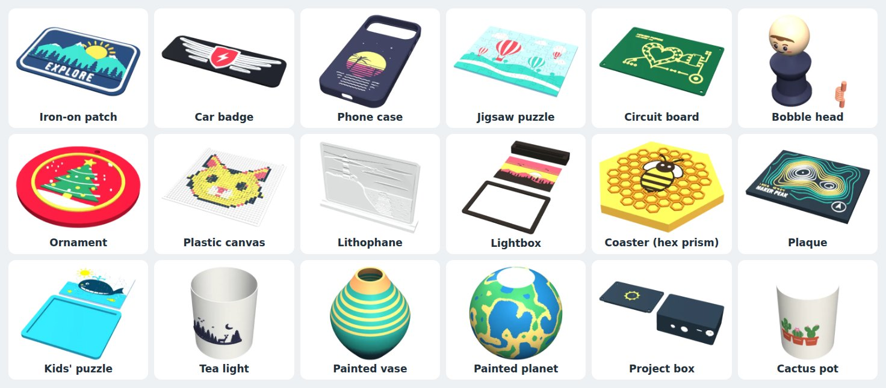

## 0.19

- **More ways to paint.** On the Paint tab's **Brush and fill** page:
  - **Pick colour** (key I) takes a colour from the model.
  - **Recolour** (key R) changes every part of one colour into another in one click.
  - **Box or lasso** (key A) paints everything inside a box or a loop you draw over the model: the side you see, or right through.
  - The brush **lights up what it will paint** before you press.
  - **Repeat round the middle** copies every stroke 2 to 12 times round the model, for vases, mandalas and wheels.
  - The **smart brush** stops at sharp edges, so painting a face does not spill round the corner.
- **Edges and hollows.** A new automatic colour: ridges and edges in one filament and hollows in another, for worn paint, stone and wood.
- **Pictures round a model.** The picture step can wrap a picture round the model like a label on a mug, or over it like a map on a globe.
- **Layers and colour changes.** A new Paint page counts the colour changes in the print, layer by layer, and estimates the filament they flush away and the time they take. Your printer sets the figures (a tool changer wastes far less than an AMS), and you can change them. A slider cuts the model open at any layer to show its colours. A painted figure can easily need hundreds of changes; now you see it before you print.
- **Patterns for colour.** Easy reading can put a pattern on each filament (stripes, lines, dots, hatching, checks) on the model and on the swatches, so filaments can be told apart without colour.

| Box select on the vase | Patterns on each filament | Colour changes, layer by layer |
| --- | --- | --- |
| 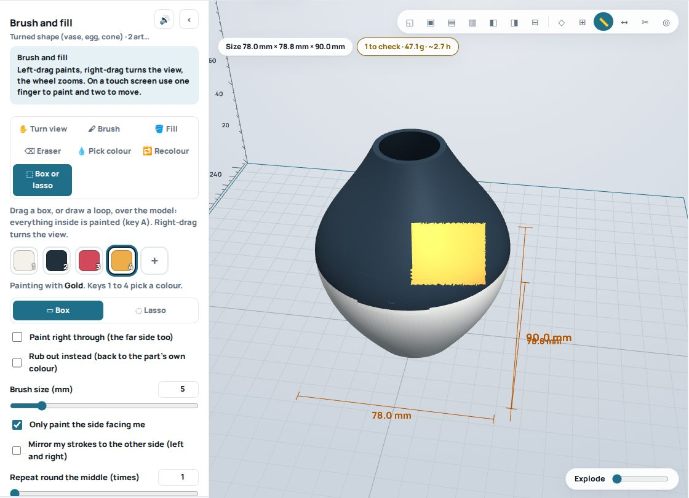 | 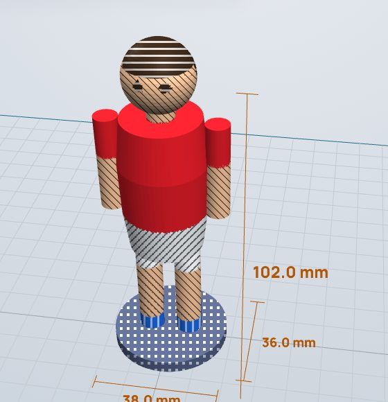 | 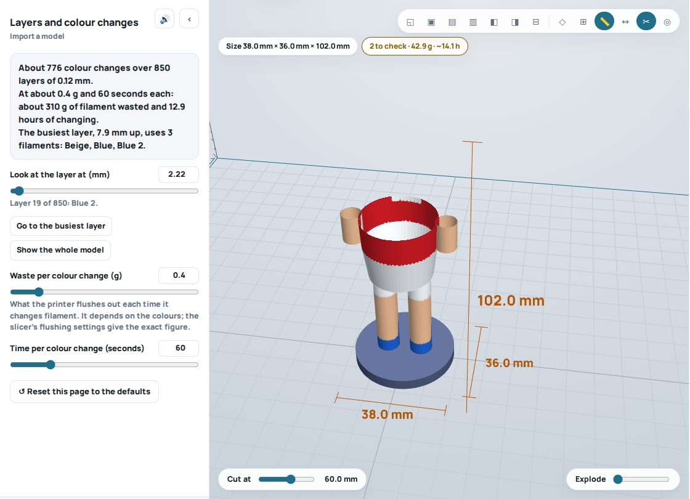 |

## 0.18.1

- **AI figure finder for busy backgrounds.** Colouring from a photo finds the figure by its colour against the background, which fails on a shelf, a desk or a patterned wall. On the photo card, **Busy background? Find the figure with AI** runs a small AI model (U²-Net, 4.6 MB) that marks the photo's main object, then lines the photo up from that. Nothing loads until you press it: then it downloads once (about 19 MB with its runtime, ONNX Runtime Web), every file is checked against its known fingerprint before it runs, and it works on your computer (your photos are not sent anywhere). Its result is saved with the project, so a reopened project colours the same without it. In tests with one front photo of a figure in front of a bookshelf, finding it by colour got 48 to 58% of the surface right; with the AI, 83 to 85% (87% on a plain background).
- Lining up picks the angle more steadily (a turn away from the side you chose has to fit clearly better), and a thin rim of background round a slightly misplaced outline no longer takes a filament of its own.

## 0.18

- **Colour a model from a photo.** Import a plain model (a figurine, a bust, a toy), open the **Paint** tab and drop a coloured photo of it on **From a photo of the model**. The app finds the figure in the photo, lines it up with the model's outline by itself (size, place, a slight turn, and the angle the photo was taken from), picks your filaments from the photo's colours (light and shade count as one colour; 2 to 8 colours, starting from the number your printer loads) and colours the model. The colour only goes where the photo really sees (the face does not come out on the back of the head); what no photo shows takes the nearest colour, and small specks are cleaned up while small details such as eyes stay. Add a photo from the back or a side for those parts (up to six photos). Fine-tune by dragging the photo, with the arrow buttons or keys, or by picking the side it was taken from; **Colours it reads** shows each colour in the filament it prints in. Then touch up with the brush and fill: they paint on top. The photos are saved in the project file.

| A plain figure coloured from a photo of its front and one of its back |
| --- |
| 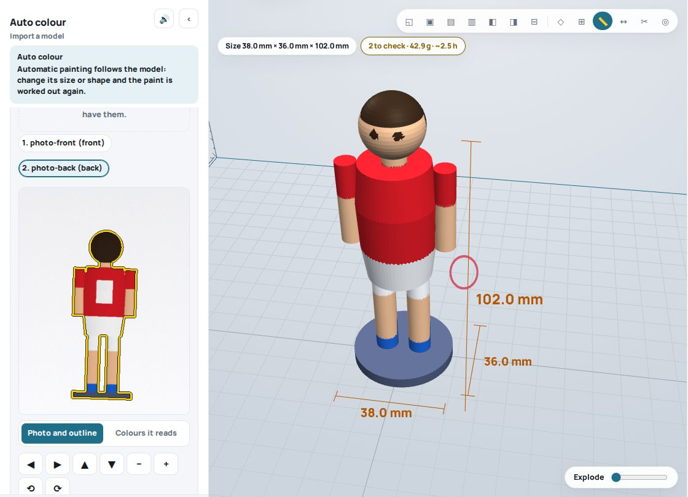 |

## 0.17.2

- **Every font is built in.** The 34 lettering fonts and the Easy reading font are inside `index.html`, so the page never downloads a font (and never talks to Google).
- **Saved projects keep imported models.** A project file now holds the model you imported and its paint. The autosave and share links still leave the model out and tell you which file to open again; opening the same file brings the paint back. Undo after opening a second model brings back the first.
- Fixed: a picture on a photo frame landed in the window and printed nothing (it now goes on the border); the arrow keys on the tab bar also moved your artwork; unticking "Show the paint" also left the paint out of the exported files without a word (it is now "Use the paint", with a warning); the phone case's Art tab showed placement controls that did nothing; damaged project files could crash a build.

## 0.17

- **Colour painter.** A new **Paint** tab colours any model, made here or imported, in up to eight filaments: **height bands** cut straight into the mesh, a **colour fade** between two filaments layer by layer, **stripes**, **tops and sides**, **separate pieces**, **smooth areas** split at sharp edges, a **picture projected** through the model, **random blobs**, or by hand with a **brush, fill and eraser** (mirror strokes for symmetrical models, keys 1 to 8 for colours). Painting follows the model when a setting changes. The paint goes into the 3mf files as slicer paint (`paint_color` for Bambu Studio and OrcaSlicer, `mmu_segmentation` for PrusaSlicer), so there is nothing to paint again in the slicer.
- **Import STL, OBJ and 3MF.** 3mf files from Bambu Studio, OrcaSlicer and PrusaSlicer keep their painting, the filament each part prints in, and the filament colours, so a model painted elsewhere can be repainted here.
- **Phone cases** for 75 phones, from the iPhone SE to the iPhone 18 Pro Max and Galaxy S26 Ultra (sizes from the makers' spec sheets): a snug TPU case or a bumper, a quick **fit test rim**, holes for the buttons and the port, a camera opening, a lip that prints without support, and a picture inlaid in the back in several colours.
- **39 printers**, grouped by maker, including the Bambu X2D, H2S, H2C and P2S, Prusa CORE One, Creality K2, Elegoo Centauri Carbon, Snapmaker U1 and more. Your printer is remembered for every new project.
- **Easy reading.** The **Aa** button makes text and buttons bigger (up to 175%), switches on high contrast, uses a font drawn for low vision (Atkinson Hyperlegible), keeps messages up longer and can read them aloud; 🔊 reads the open page aloud. Every slider has a **↺ default** button and every page a **Reset this page** button.
- **Project boxes:** round holes are round again (pointed tops are an option), and choosing a fan, display or board bigger than the box makes the box grow to fit instead of quietly leaving it out.
- **Pilot lights** wherever an LED goes: a printed **jewel lens** for a plain 3 or 5 mm LED (print it in a clear or coloured see-through filament), or holes sized for bought chrome-bezel LED holders and metal pilot lights from 8 to 22 mm.
- Fixed: reopening a saved project quietly changed four settings (charm size, picture size, artwork outline width and the plastic canvas pixel count).

| Colour fade and stripes on the Paint tab | Brush with mirrored strokes |
| --- | --- |
| 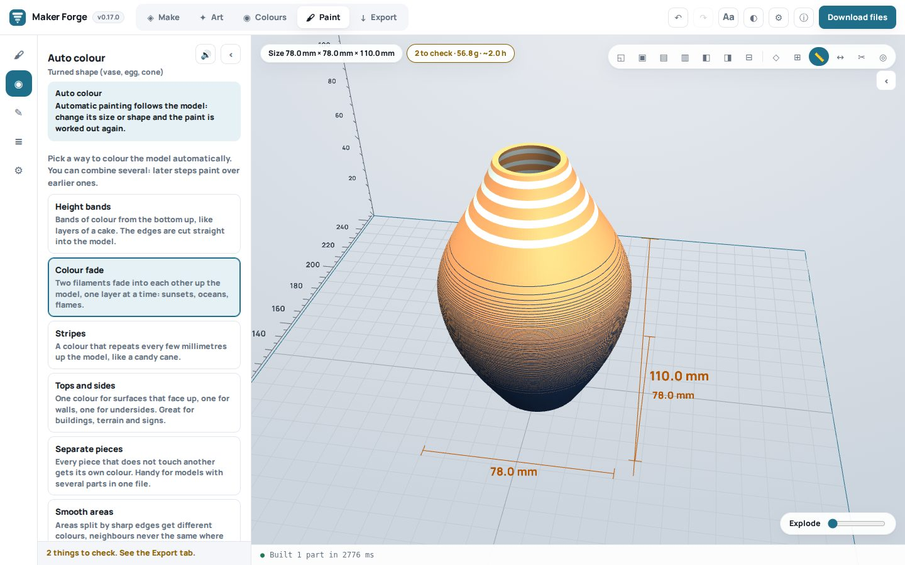 | 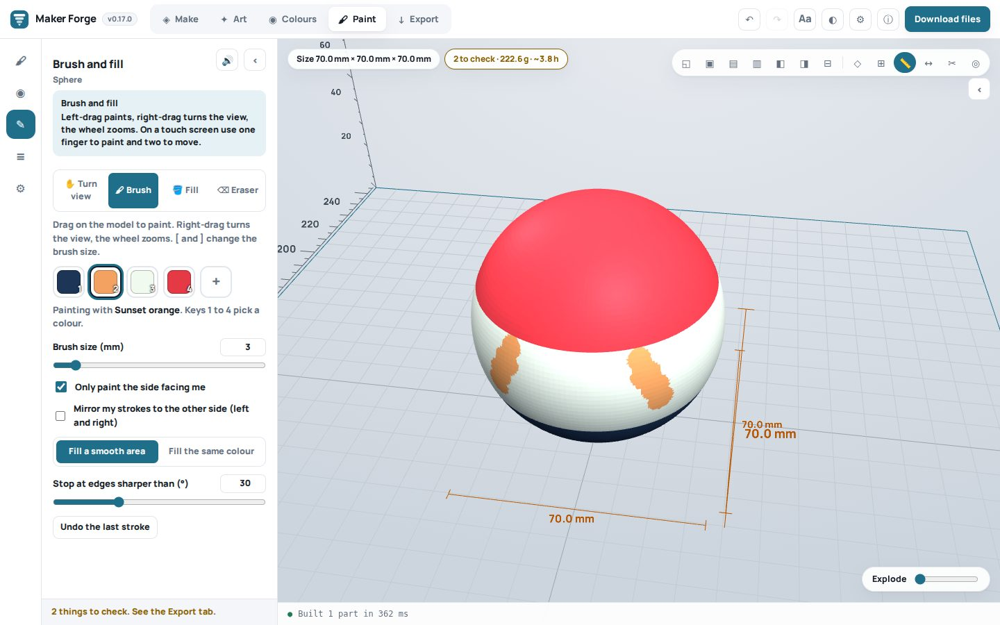 |
| **Phone case** for an iPhone 17 Pro | **A picture inlaid in the case's back** |
| 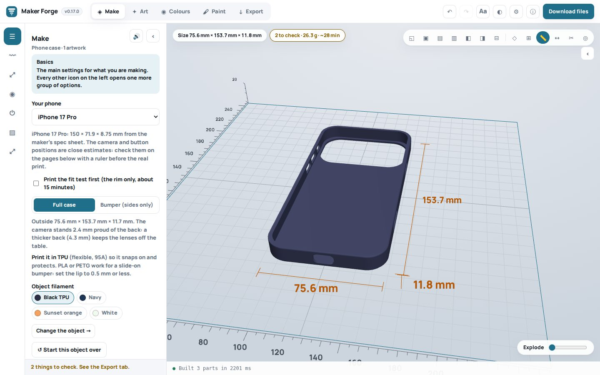 | 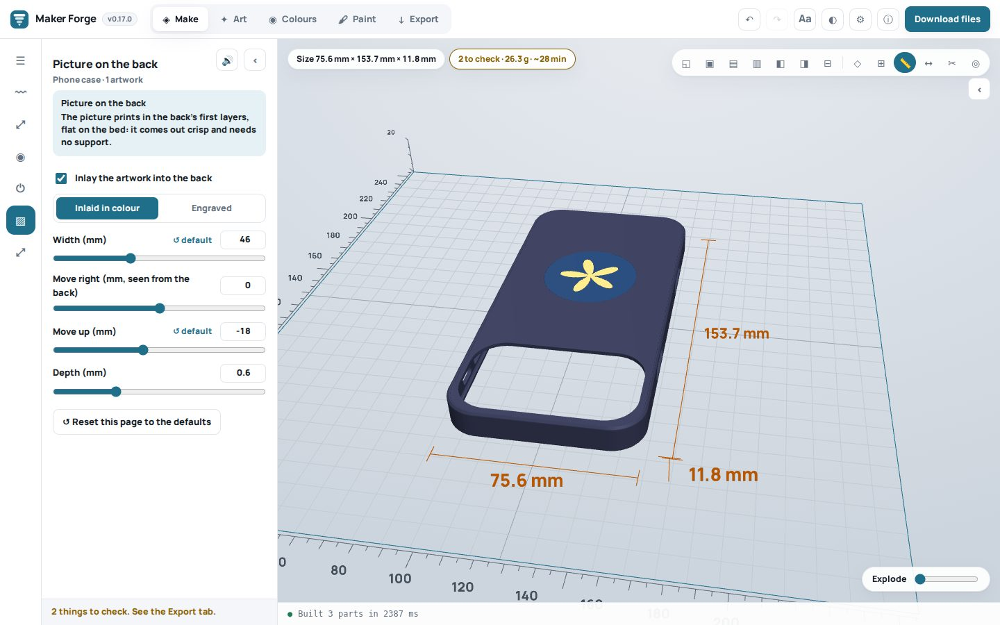 |
| **39 printers**, your Bambu X2D remembered | **Easy reading:** bigger text, high contrast, clear letters |
| 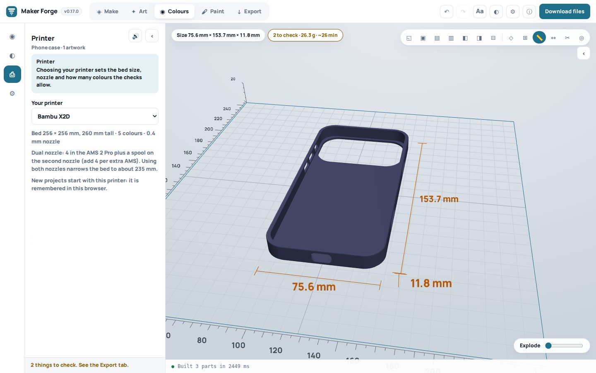 | 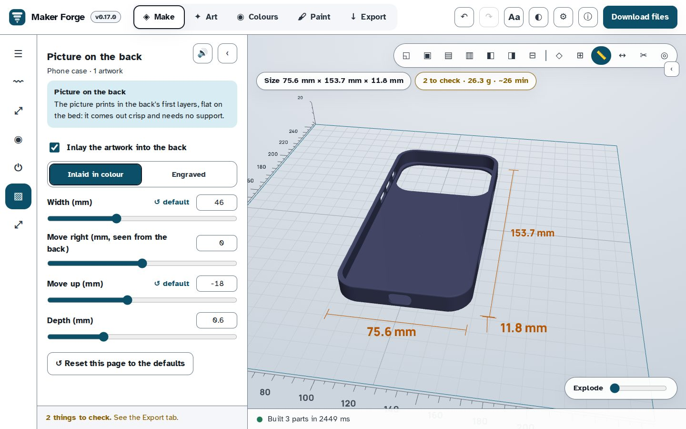 |
| **A PSU box with a 120 mm fan**: round grille, the box grew to fit | **Pilot lights** with printed jewel lenses |
| 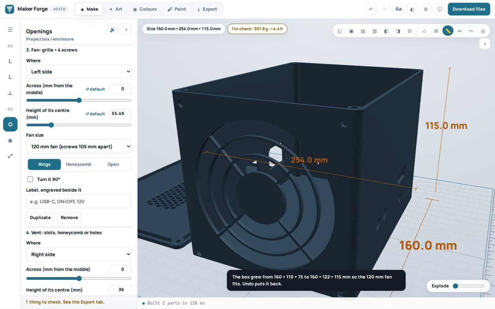 | 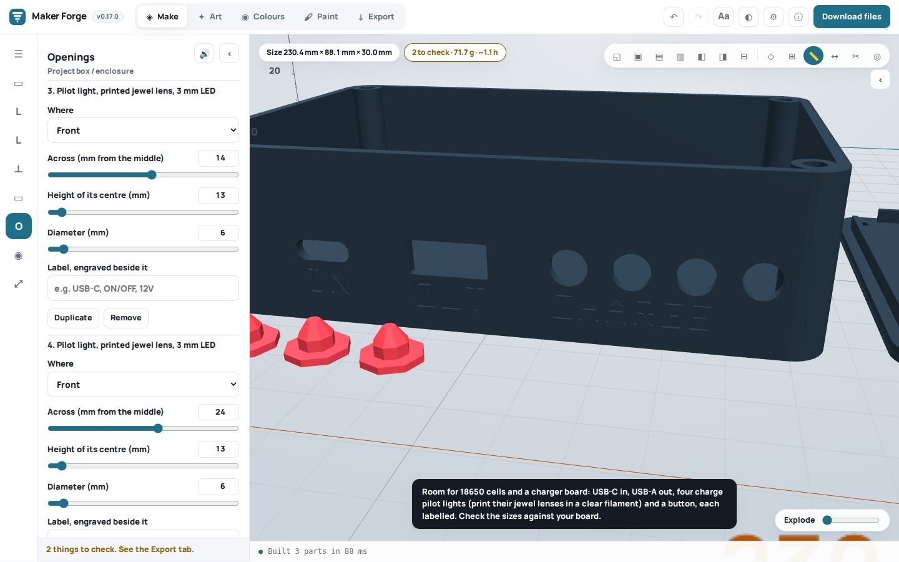 |

## 0.16

- **Project boxes grew up.** Engraved labels beside any opening ("USB-C", "ON/OFF", "12V"), magnet lids, a sliding lid on 45° rails, stick-on-foot recesses, ports that open to the top edge so the lid closes them, pointed tops for wide ports, your logo inlaid into the lid in its own colours, and a **fit test**: a small box with your walls, lid, screws and one of each opening, to try before the real print. The stock boxes now print without support.
- **Tracer:** SVG logos are drawn sharp and keep the size stated in the file; hairlines can be thickened to a printable width; multi-colour logos keep their colours on a body in your main filament; back plates get a hanging hole, a keychain loop or countersunk screw holes placed clear of the shape.
- **Name plates from a list:** paste names (or a spreadsheet column) and each gets its own plate, packed onto the bed.
- **Measure and look inside:** a measuring tape that snaps to corners, a section view that cuts the model at any height, and rulers in inches when you work in inches.
- **Share a link** that opens the same design for someone else (pictures stay on your machine).
- **Lithophane test strip:** steps from 0.6 to 3.2 mm, numbered, to choose thicknesses for your filament.
- **Checked in a real browser:** `npm run check:browser` opens the app in Chromium and walks every object and page. It found and fixed a name plate bug that only real fonts showed: plates with charms were clipped and printed with holes under the letters.
