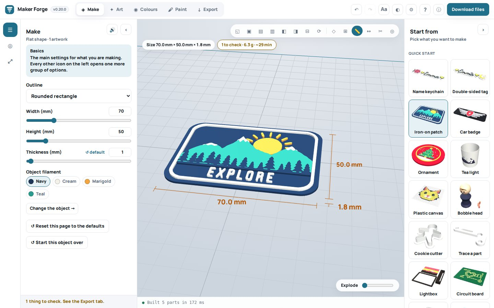
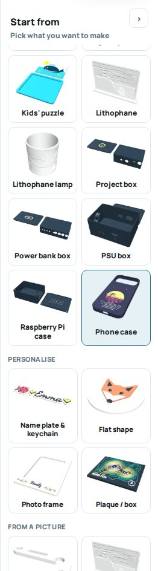
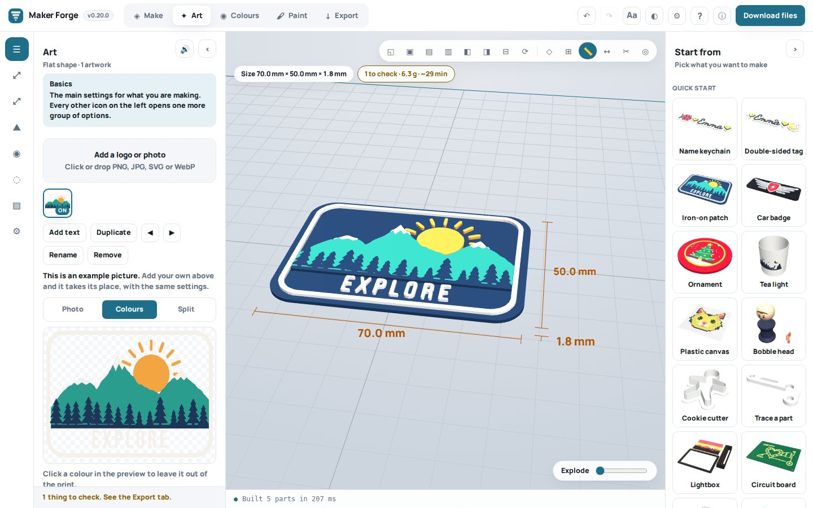
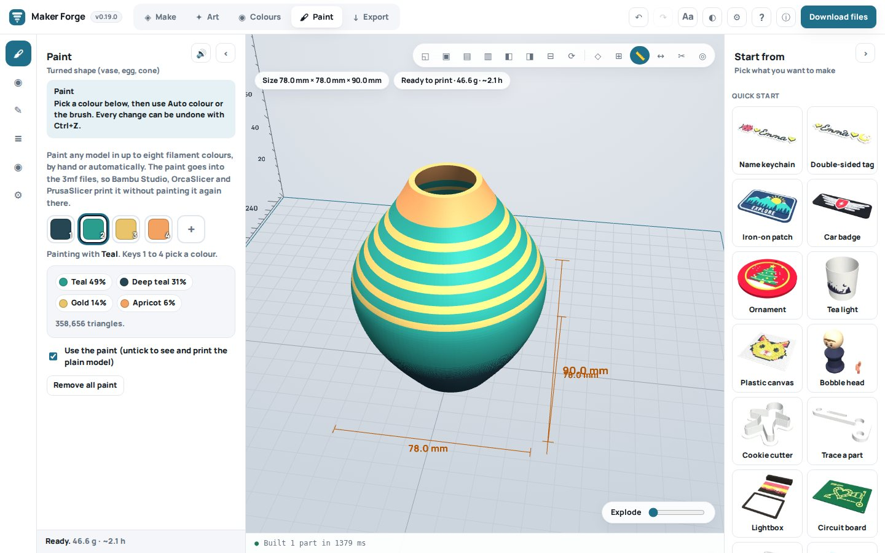
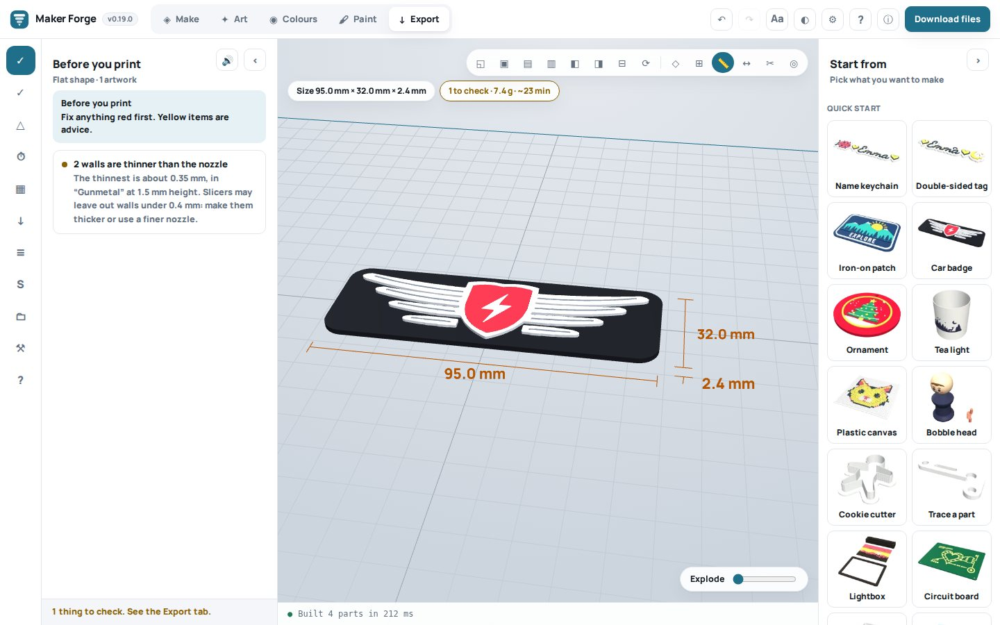

# Maker Forge user manual

Maker Forge turns names, photos, logos and measurements into multi-colour parts you can 3D print. It runs in your web browser, on your own computer: nothing is uploaded, and there is no account to make.

This manual walks through the app from the first click to a finished print. The same text is inside the app: press **?** in the top bar.

## Contents

1. [Getting started](#1-getting-started)
2. [Start from: quick starts, objects and examples](#2-start-from-quick-starts-objects-and-examples)
3. [Make: the object itself](#3-make-the-object-itself)
4. [Art: pictures and text](#4-art-pictures-and-text)
5. [Colours: your filaments and your printer](#5-colours-your-filaments-and-your-printer)
6. [Paint: colouring a whole model](#6-paint-colouring-a-whole-model)
7. [Export: checks and files](#7-export-checks-and-files)
8. [The 3D view](#8-the-3d-view)
9. [Saving, opening and sharing](#9-saving-opening-and-sharing)
10. [Easy reading](#10-easy-reading)
11. [Keyboard shortcuts](#11-keyboard-shortcuts)
12. [Printing tips](#12-printing-tips)
13. [When something goes wrong](#13-when-something-goes-wrong)
14. [Privacy](#14-privacy)

## 1. Getting started

Open `index.html` in a recent browser (Chrome, Edge, Firefox or Safari). That is the whole install. Keep the file anywhere you like; it works from your desktop or a USB stick. The first time, it needs the internet for a moment to fetch three small code libraries.

The screen has five areas:

- **The top bar.** The five tabs, **Make · Art · Colours · Paint · Export**, then Undo and Redo, **Aa** (Easy reading), light or dark, Settings, **?** (this manual), About, and **Download files**.
- **The page icons** down the left edge. Each tab's settings are split into pages; click an icon to open that page. The first icon of every tab holds the everyday settings.
- **The panel** next to them, with the settings of the open page. Every slider has a **↺** button that puts it back to where it started, and every page has **Reset this page** at the bottom. The **🔊** button reads the page aloud.
- **The 3D view** in the middle: the model as it will print, sitting on your printer's bed. The line at the top says its size and whether it is ready to print.
- **Start from** on the right: every quick start and every object, each with a picture of what it makes.

The line along the bottom says what the app is doing. Click it to see a log of everything that happened.

### On a phone or tablet

Maker Forge works on phones and tablets too. On a narrower screen, or with bigger text from **Aa**, the layout changes to fit:

- **Start from** becomes a button in the top bar. It opens the quick starts and objects over the page, and closes once you have chosen one (or with **✕**).
- The less-used buttons in the top bar (Redo, **Aa**, light or dark, Settings, the manual and About) move into the **⋯** menu.
- The seven view buttons fold into one, **◱▾**.
- On a phone held upright, the model sits at the top and the settings scroll below it. The page icons run in a row between the two. **‹** hides the settings so the model gets the whole screen; tap any page icon to bring them back. Turn the phone on its side and the settings sit beside the model instead.
- In the 3D view, drag with one finger to turn the model and use two fingers to zoom and move it. While you paint, one finger paints and two fingers zoom; choose **Move the view** to turn the model.

A computer is still the easiest place for detailed work, but every setting, and **Download files**, is within reach on a phone.

### Your first print in five steps

1. Click a button under **Start from**, for example **Iron-on patch**. A finished example appears.
2. On the **Art** tab, add your own picture. It takes the example's place, with the same settings.
3. On the **Colours** tab, choose your printer and set the filament colours to the spools you have loaded.
4. On the **Export** tab, read **Before you print**. Fix anything red.
5. Press **Download files**. Open the 3mf file from the zip in your slicer and print.

## 2. Start from: quick starts, objects and examples

The **Start from** sidebar has two kinds of button.

- **Quick starts** set everything up for one product: the object, its size, the filaments that suit it and a tip on how to print it. *Car badge*, for example, makes a 95 × 32 mm plate and reminds you that PLA softens in a hot car.
- **Objects** are the makers behind the quick starts: a flat shape, a name plate, a jigsaw, a lithophane and so on. Choosing one keeps your pictures and colours and changes only the object.

### The examples

While you have no pictures of your own, every button opens with a finished example, so you can see what it makes before you start: a mountain patch, a winged car badge, a Christmas bauble, a pixel-art cat, a circuit board with an LED heart, a hot-air balloon jigsaw, a lighthouse lithophane, a phone case with a retro sunset, and more. The example's picture is marked **Example** on the Art tab.

- **Add your own picture** and it takes the example's place, with all the same settings. On a phone case or a project box, your picture goes onto the back or the lid, just as the example did.
- The example also picks **filaments** that match its picture, but only while you have not changed them yourself. Undo (Ctrl+Z) brings your old colours back.
- The vase and the planet show off the **Paint** tab instead: their colours are painted on, and you can change or clear them there.
- A phone case and the project boxes carry their picture on the side that prints on the bed, so they open **turned over** to show it. The **⟳** button above the model turns them back.

All the example pictures were drawn for Maker Forge and are free to use, like the rest of the app.

### What each quick start makes

| Quick start | What it makes | What you add |
| --- | --- | --- |
| Name keychain | A name with a border, a ring hole and charms | Type a name; optionally a small picture beside it |
| Double-sided tag | A tag that reads from both sides | A name |
| Iron-on patch | A thin, flexible badge to sew or iron on | A logo or drawing |
| Car badge | A long badge for a car or a bike | A logo |
| Ornament | A round bauble with a hanging hole | A picture |
| Tea light | A lantern to put over an LED tea light | A silhouette, or a photo as a glowing relief |
| Plastic canvas | A square-by-square mosaic, like cross-stitch | A small picture or pixel art |
| Bobble head | A head on a spring neck and a body | A face |
| Cookie cutter | A cutter that follows a picture's outline | A silhouette |
| Trace a part | A copy of a flat part from a photo of it | A photo of the part on white paper |
| Lightbox | A backlit picture panel with a frame and stand | A photo or drawing |
| Circuit board | A decorative board with raised copper | A schematic or PCB screenshot |
| Photo frame | A frame with a picture on its border | A small picture or words |
| Jigsaw puzzle | A puzzle that prints in one go | A picture |
| Kids' puzzle | Twelve chunky pieces in a tray | A bold picture |
| Lithophane | A picture that appears when light shines through | A photo |
| Lithophane lamp | A lithophane cylinder for an LED tea light | A wide photo |
| Project box | An electronics box with a screwed lid | Optionally a logo for the lid |
| Power bank box | A box for 18650 cells and a charger | Optionally a logo |
| PSU box | A box for a mains power supply module | Nothing |
| Raspberry Pi case | A case with standoffs for a Pi | Nothing |
| Phone case | A TPU case for one of 75 phones | Optionally a picture for the back |

## 3. Make: the object itself

The **Make** tab holds the settings of the object you chose: its size, shape, thickness, holes and everything particular to it. The first page, **Basics**, has the ones most people need. The other pages hold the rest; a short line at the top of each page says what it is for.

At the bottom of the Basics page:

- **Object filament** says which of your filaments the object prints in.
- **Change the object** opens the Start from sidebar.
- **Size and mirror** scales the whole model, or mirrors it.

Some objects in brief:

- **Name plate and keychain.** 34 lettering fonts, charms (♥ ★ and any emoji) on either side, a picture beside the name, raised or engraved letters, a top layer in a second colour, and a mirrored back for double-sided tags. **A keychain for every name** on the Export tab makes one per name from a list.
- **Photo to 3D tracer.** Photograph a flat part on plain paper, shot from straight above. Give one real measurement, or let the sheet of paper be the ruler. Round holes become true circles. The outline also downloads as SVG and DXF.
- **Lithophane.** Flat, curved or a cylinder, with a rectangle, arch, oval or heart outline. The **test strip** prints steps from 0.6 to 3.2 mm, so you can choose thicknesses for your filament.
- **Jigsaw puzzle.** Choose the number of pieces, the style of the knobs and the gap. **Shuffle** draws a new cut. A frame or a tray can print with it.
- **Project box.** Openings for USB, buttons, switches, fans, displays and pilot lights, each with an optional engraved label. Screwed, magnet or sliding lids. **Fit test** prints a small box with one of each opening, to try before the real thing.
- **Phone case.** Pick your phone; the sizes come from the makers' spec sheets. Print the **fit test rim** first. Print the case in TPU.

## 4. Art: pictures and text

The **Art** tab puts pictures and words on the object.

- **Add a logo or photo**: click the box or drop files on it. PNG, JPG, SVG and WebP all work. SVG files keep their real size.
- **Add text**: words in any of the fonts.
- The list shows every picture. Click one to select it; the buttons below duplicate, reorder, rename or remove it. When you add a new picture, the earlier ones are switched off so they do not land on top of each other; click a thumbnail to switch one back on.

**The preview** has three modes: **Photo** (the picture as it is), **Colours** (the picture split into your filaments) and **Split** (half and half). Click a colour in the preview to leave it out of the print.

**Size and place.** Set the width, the rotation and which side it goes on. Click the model in the 3D view to move the picture there, or nudge it with the arrow keys (0.5 mm, or 2 mm with Shift).

**How it prints:**

- **Flat colour**: each colour is a raised layer of one height. Best for logos and drawings.
- **Stepped**: each filament a little higher than the last, for depth.
- **Photo relief and lithophane**: brightness becomes thickness.

**Colours.** A picture prints in the filament closest to each of its colours. You can print it all in one filament, leave colours out, **Drop the background colour**, add an **outline** that holds separate pieces together, adjust brightness, contrast and saturation, and snap it to squares for a pixel look.

On some objects the picture *becomes* the object: a cookie cutter, a lightbox, a jigsaw, a tracer, a circuit board, a lithophane. Their size and shape are then set on the Make tab, and the Art tab shows only what they use.

**Cut out the subject with AI.** A photo with a background, such as a pet on a sofa or a person in a room, shows **✨ Cut out the subject with AI** under the preview (a keychain's picture shows it on the Make tab too). It takes the background away and trims the picture to the subject, so only the subject prints. The first time, it downloads the AI figure finder (about 19 MB, checked before it runs); after that it works straight away, and the photo never leaves your computer. If it took too much or too little, **Put the background back** returns the photo as it was. Pictures that already have a clear background, such as most logos, do not show the button.

**Tips for good pictures:** bold shapes and a few flat colours print best. Small print below about 1 mm wide may not show. Anything that touches the edge of the picture is taken to be background and left out, so leave a little space round your drawing.

## 5. Colours: your filaments and your printer

**Loaded filaments.** One row per spool: its colour, name, material and price per kilo. Set these to the spools you really have loaded; slot 1 is the first spool in your AMS or first extruder. **Add filament** goes up to eight. **Palettes** fill in a set of colours at once, and **Match to artwork** picks colours from the selected picture.

**Printer.** Choose your printer from the list (39 models, grouped by maker). It sets the bed size, the nozzle and how many colours the printer loads at once, and the app remembers it for every new project. For a printer that loads one colour at a time, the Export tab lists the heights at which to swap filament.

## 6. Paint: colouring a whole model

The **Paint** tab colours the whole surface of a model, made here or imported (STL, OBJ, 3MF, GLB or glTF). It works in up to eight filaments.

**Models that come with colours.** Models from AI model makers (Meshy, Tripo, Rodin and others), from scans and from most 3D apps often carry their colours, as a GLB file, or an OBJ with colours on its corners or an MTL file and a picture. Choose **Import a model** in the Start from sidebar (or **Open a different model** on the Make tab). For an OBJ with an MTL file and pictures, choose the OBJ, the MTL and the pictures together. The model opens already painted: the step **The model's own colours** turns its colours into as many filaments as your printer loads.

- **Number of colours** sets how many filaments it uses.
- **Set my filaments to its colours** changes your loaded filaments to match the model; **Use my loaded filaments** keeps your spools and paints each part in the nearest one.
- **Tidy single stray triangles** removes lone specks of colour that would each cost a colour change.

GLB files are measured in metres; the app turns them into millimetres. A model that would be smaller than 10 mm or bigger than 500 mm across is made 80 mm across, and the app says so; change the size on the Make tab. Compressed GLB files (Draco or meshopt) cannot be opened: export them again without compression.

**Auto colour** paints the model for you, and follows it when its size or shape changes:

- **Height bands**: colours stacked in layers.
- **Colour fade**: one filament fading into another, layer by layer.
- **Stripes**, **tops and sides**, **separate pieces**, **smooth areas** split at sharp edges.
- **Edges and hollows**: ridges in one colour and hollows in another, for worn paint, stone and wood.
- **A picture**, projected through the model, wrapped round it like a label, or over it like a map on a globe.
- **Random blobs**, for camouflage or planets.
- **From a photo of the model**: drop a photo of a real figure and the app lines it up and colours the model from it. If the background is busy, **Find the figure with AI** (a one-time download of about 19 MB) finds it for you.

**Fixing the figure by hand.** On the photo card, **Figure it found** darkens everything the app takes for background. If it took in some background, or missed a part of the figure, choose what dragging on the photo does: **Take away** paints background out, **Add to the figure** paints a missed part in. Start with a big brush away from the figure, then use a small one near its edges. The colours use your fixes straight away; press **Line it up again** to line the photo up with them too. **Undo the last fix** and **Clear my fixes** take them off, and **Move the photo** goes back to dragging the photo into place. The fixes are saved with the project.

**Brush and fill** paint by hand:

| Tool | Key | What it does |
| --- | --- | --- |
| Brush | B | Paints where you drag. It lights up what it will paint before you press. |
| Fill | F | Fills one smooth area. |
| Eraser | E | Takes paint off. |
| Pick colour | I | Takes a colour from the model. |
| Recolour | R | Changes every part of one colour into another. |
| Box or lasso | A | Paints everything inside a box or a loop you draw: the side you see, or right through. |
| Move the view | V | Drag turns the model instead of painting. |

Keys **1** to **8** pick a filament, **[** and **]** make the brush smaller or bigger. **Mirror** paints both sides at once, **Repeat round the middle** copies each stroke 2 to 12 times round the model, and the **smart brush** stops at sharp edges.

**Paint list** shows every step in order; a later step paints over an earlier one. **Layers and colour changes** counts how many times the printer swaps colour, how much filament that flushes away and how long it takes, and can cut the model open at any layer. **Paint detail** decides how finely the model is split: finer follows small shapes better but makes bigger files.

The paint goes into the 3mf files as slicer paint, so there is nothing to paint again in Bambu Studio, OrcaSlicer or PrusaSlicer.

## 7. Export: checks and files

**Before you print** lists what the app checked: that every part is closed, fits on your bed, has no walls thinner than your nozzle, uses no more colours than your printer loads, and so on. Fix anything red first; yellow items are advice. The **Printability** page shows where the model needs support, and **Optimize** turns it to need the least.

**Material and time** gives the grams, metres and cost of each filament and a rough print time. **Colour swap heights** is for printers that load one colour at a time.

**Files.** **Download print files** makes a zip with:

- `model-bambu.3mf` for Bambu Studio, and `model-prusa-orca.3mf` for PrusaSlicer and OrcaSlicer, with every part assigned to its filament;
- a coloured OBJ, one STL per filament and one merged STL;
- printing notes and the project file.

Also on this tab: **A keychain for every name**, **Share a link**, the **Project file** buttons and **Slicer notes**.

## 8. The 3D view

- **Drag** to turn the model, **right-drag** (or two fingers) to move it, and **scroll** (or pinch) to zoom.
- On the Art tab, **click the model** to move the selected picture there.

The buttons above the model:

| Button | What it does |
| --- | --- |
| ◱ ▣ ▤ ▥ ◧ ◨ ⊟ | Look from an angle, from above, the front, behind, the left, the right or below |
| ⟳ Turn over | Shows the model upside down, to see the side that prints on the bed (the files do not change) |
| ◇ Wireframe | Shows the triangles |
| ⊞ Layout | Lays the parts out as they print, side by side |
| 📏 Rulers | Shows the size on the model |
| ↔ Measure | Click two points to measure between them; it snaps to corners |
| ✂ Section | Cuts the model open at a height, to look inside |
| ◎ Save a picture | Downloads a PNG of the view |

The **Explode** slider pulls a model with several parts apart.

## 9. Saving, opening and sharing

- Your work is **saved in this browser** as you go, and comes back when you open the app again. Settings can turn this off.
- **Ctrl+S** (or **Save project** on the Export tab) downloads a project file (`.json`) with everything in it, pictures and imported models included. **Open project** opens one again. The last three projects you saved or downloaded files for are listed there too, to open with one click.
- **Share a link** puts your design in a link to send to someone. Pictures are left out of links; send the project file for those.
- **Start over** clears everything for a new project.

## 10. Easy reading

The **Aa** button in the top bar:

- makes all text and buttons bigger, up to 175%;
- switches on high contrast;
- uses Atkinson Hyperlegible, a font drawn for people with low vision;
- keeps messages on screen longer, or until you click them, and can read them aloud;
- can put a **pattern** on each filament (stripes, dots, hatching) on the model and the swatches, so colours can be told apart without seeing colour.

The **🔊** button reads the open page aloud. Everything can be reached from the keyboard: Tab moves between controls and the arrow keys move between tabs and page icons. Your Easy reading choices are kept in this browser.

## 11. Keyboard shortcuts

| Keys | What they do |
| --- | --- |
| Ctrl+Z | Undo |
| Ctrl+Shift+Z or Ctrl+Y | Redo |
| Ctrl+S | Save the project file |
| Delete | Remove the selected picture (Art tab) |
| Arrow keys | Nudge the selected picture 0.5 mm (Art tab); with Shift, 2 mm |
| 1 to 8 | Pick a filament (Paint tab) |
| [ and ] | Smaller or bigger brush (Paint tab) |
| B F E I R A V | Brush, fill, eraser, pick colour, recolour, box or lasso, move the view (Paint tab) |
| Escape | Close a window |

On a Mac, use Cmd instead of Ctrl.

## 12. Printing tips

- **Flat pieces** print face down on the bed with no supports.
- **Iron-on patches** in TPU flex with the fabric. **Car badges** in ASA or PETG: PLA softens in a hot car. **Keychains** in PETG last longer in a pocket.
- **Lithophanes** print standing up, in white PLA at 100% infill. Light them with an LED only.
- **Tea lights and lamps**: LED tea lights only, never a real flame.
- **Jigsaws** print assembled: snap the pieces apart afterwards. A gap of 0.2 to 0.3 mm suits a 0.4 mm nozzle.
- **Phone cases** print in TPU so they snap on. Print the fit test rim first.
- **Bobble heads**: print the spring in TPU.
- **Mains boxes**: use a certified, enclosed power supply module, earth the inlet and print in PETG or ASA.
- **Cookie cutters**: PETG, two walls, no infill. Wash by hand.
- **Colour changes cost filament.** A picture with many small colour areas across many layers flushes a lot of filament on an AMS. The Paint tab's Layers page shows how much before you print.

## 13. When something goes wrong

**"Things to check" in the status line.** Open the Export tab: each item says what is wrong and what to do.

**The picture prints in the wrong colours.** Each colour goes to the nearest filament. Set your filaments on the Colours tab to what you have loaded, or leave colours out on the Art tab.

**Part of the picture is missing.** Anything touching the picture's edge is taken as background. Leave a margin round your drawing. Very thin lines (under about half a millimetre) are also dropped, because the nozzle cannot print them.

**The model looks empty.** Some objects are made from a picture (cookie cutter, lightbox, jigsaw, tracer, circuit board, lithophane): add one on the Art tab.

**An opened project has no model.** Projects saved in the browser and share links leave out imported models. Open the same model file again and its paint comes back.

**The app feels slow.** In Settings, lower **Maximum preview detail**. On the Paint tab, choose coarser **Paint detail**.

**My slicer shows one colour.** Open the 3mf that matches your slicer (see Export → Slicer notes). In Bambu Studio, if the 3mf will not open, import `model.obj` and accept the colour dialog.

## 14. Privacy

Maker Forge runs entirely on your computer. Your pictures, photos, models and projects are never uploaded. The page loads three code libraries from jsDelivr, a public service for open-source code, so that service sees the page was opened; the fonts are built in. The AI figure finder downloads only when you ask for it, and runs on your computer too. There are no accounts, no tracking and no adverts.

Maker Forge is open source under the MIT licence.
