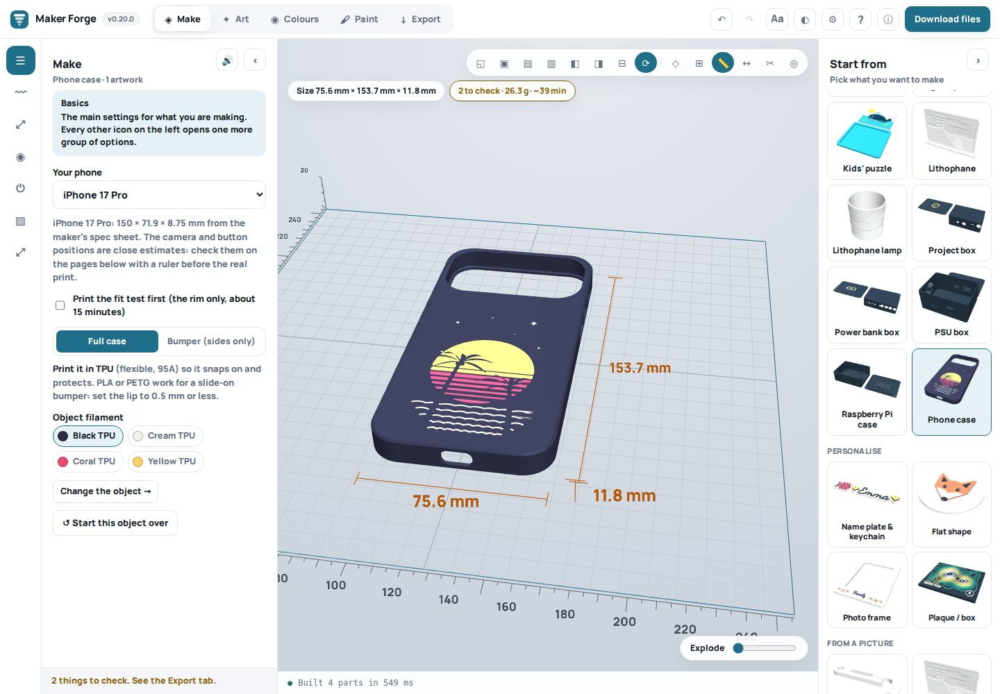
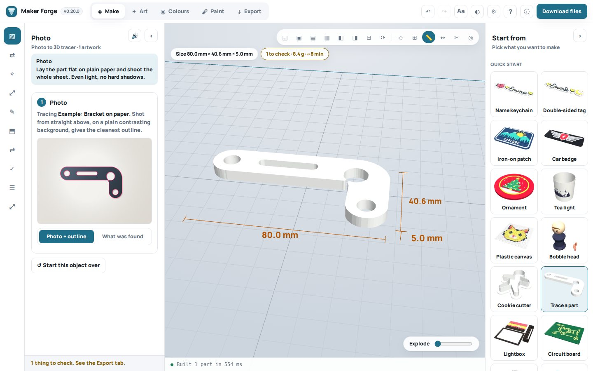
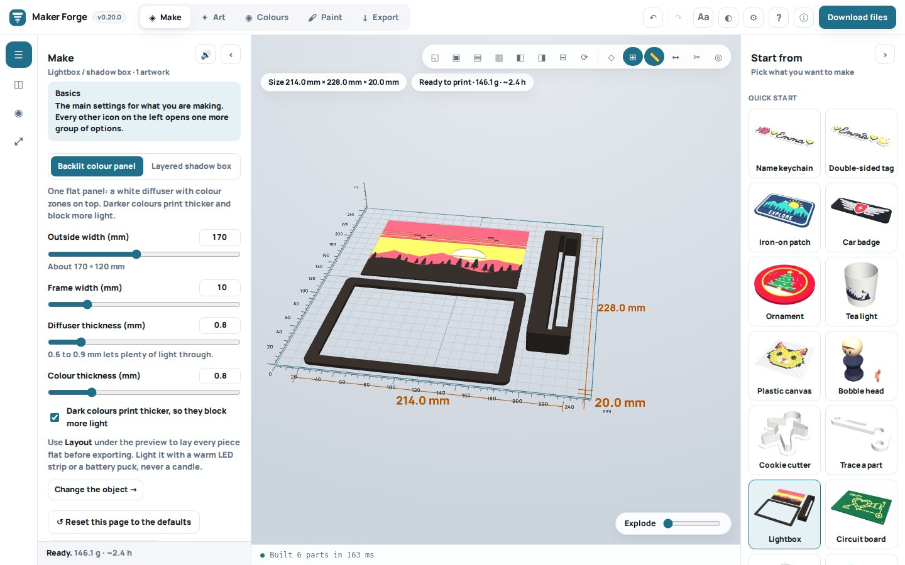
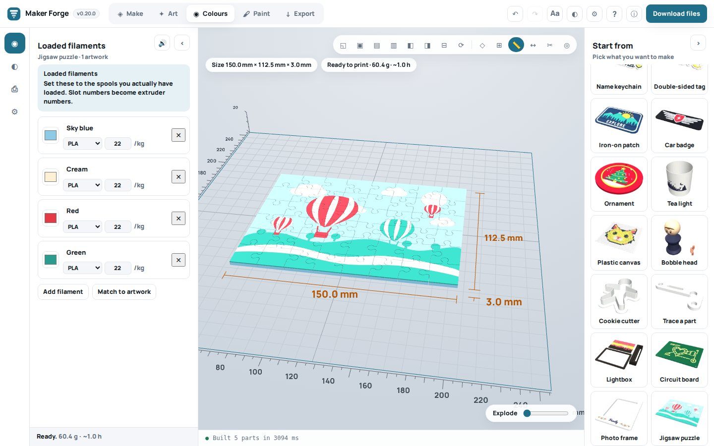
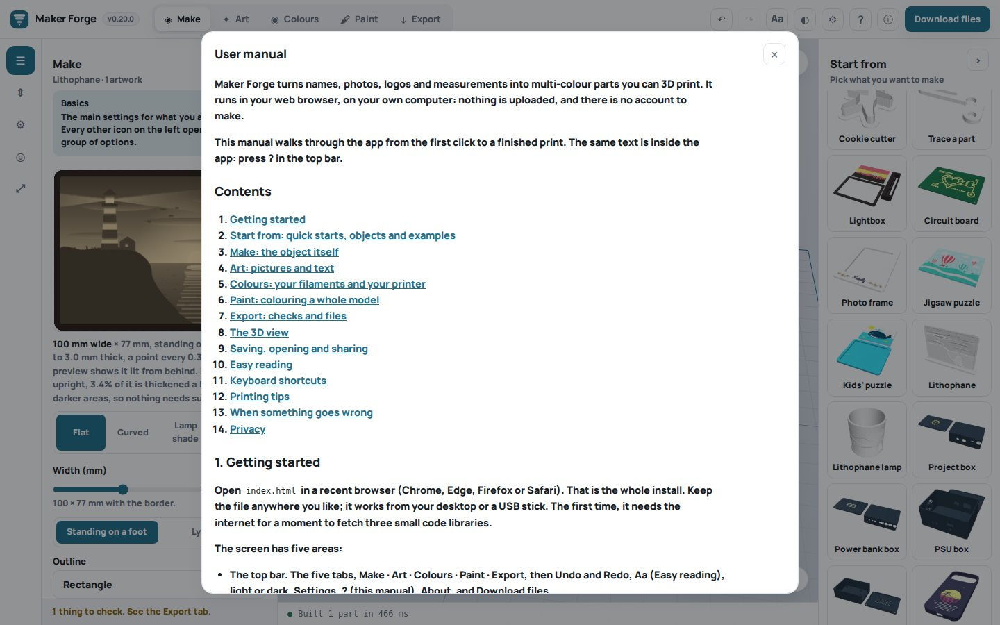

# Maker Forge: free multi-colour 3D print designer in your browser

**Turn names, photos and logos into multi-colour (multi-color) 3D prints.** Keychains and name tags, iron-on patches, car badges, Christmas ornaments, phone cases, lithophanes and lithophane lamps, jigsaw puzzles, cookie cutters, lightboxes, circuit-board art, plastic canvas pixel art, bobble heads, project boxes and electronics enclosures, and more. Paint any STL, OBJ or 3MF model in up to eight colours. Export a **3MF ready for Bambu Studio, OrcaSlicer and PrusaSlicer**, with every colour already assigned for an AMS, MMU3, CFS or ACE, plus STL and OBJ files.

Free and open source (MIT). One HTML file: no install, no account, no uploads. It runs on your own computer, even offline.

[](LICENSE)
[](CHANGELOG.md)
[](#get-started-in-a-minute)
[](#printers-and-slicers)

**[Get started](#get-started-in-a-minute)** · **[User manual](MANUAL.md)** · **[What's new](CHANGELOG.md)** · **[Examples](#what-you-can-make)** · **[FAQ](#questions)**


---

## What you can make

Every button in the **Start from** sidebar opens with a finished example, so you can see what it makes before you add anything. Drop in your own picture and it takes the example's place.


| Make | From | Good to know |
| --- | --- | --- |
| **Name keychains, name tags, bag tags** | A name, with charms (♥ ★ any emoji) and a small picture | 34 fonts, raised or engraved letters, double-sided tags, one keychain per name from a list |
| **Iron-on and sew-on patches** | A logo or drawing | Thin and flexible in TPU |
| **Car and bike badges** | A logo | Long badge shape; ASA or PETG |
| **Christmas ornaments and baubles** | A picture | Round, star or heart, with a hanging hole |
| **Phone cases** | A picture inlaid in the back | 75 phones, iPhone SE to iPhone 18 Pro Max, Galaxy S26, Pixel 11; fit test rim; TPU |
| **Lithophanes and lithophane lamps** | A photo | Flat, curved or cylinder for an LED tea light; test strip |
| **Jigsaw puzzles and kids' puzzles** | A picture | Prints assembled in one go; frame or tray; shuffle the cut |
| **Cookie cutters** | A silhouette | Follows the picture's outline |
| **Lightboxes and paper-cut shadow boxes** | A photo | Backlit colour panel or stacked layers, frame, stand, LED channel |
| **Circuit-board art (PCB look)** | A schematic or PCB screenshot | Raised copper on solder mask, mounting holes, edge fingers |
| **Plastic canvas, mosaics, pixel art** | A small picture | One square per stitch |
| **Bobble heads** | A face | Printed spring neck |
| **Tea lights and lanterns** | A silhouette or a photo | LED only |
| **Photo frames, plaques, coasters, cylinders, spheres, vases** | A picture, or paint | Turned shapes: vase, egg, cone, dome, ring |
| **Project boxes and electronics enclosures** | Openings and a lid logo | USB-C, buttons, switches, fans, displays, pilot lights, labels; Raspberry Pi case, power bank box, PSU box; fit test |
| **Replacement parts from a photo** | A photo of a flat part on paper | Photo to 3D tracer, true circles for holes, SVG and DXF outlines |
| **Your own model, painted** | An STL, OBJ or 3MF | Up to 8 colours, by hand, automatically or from a photo |

---

## Why Maker Forge

- **Multi-colour without painting in the slicer.** Every colour of your picture becomes its own part, assigned to its own filament, so the 3MF opens in Bambu Studio, OrcaSlicer or PrusaSlicer ready to print on an AMS, AMS lite, MMU3, CFS or ACE. One-colour printers get a list of heights at which to swap filament.
- **Printer-aware checks.** Choose your printer (39 models) and the app checks that the design fits the bed, uses no more colours than the printer loads, has no walls thinner than the nozzle and needs no surprise supports. It estimates grams, cost and time, including the filament flushed at every colour change.
- **Photo to 3D.** Trace a real part from a photo, turn a photo into a lithophane or a relief, or colour a 3D model from a photo of the real thing (with an optional small AI model that finds the figure on a busy background).
- **Private.** Nothing is uploaded, ever. No account, no tracking, no adverts.
- **Easy to read.** Bigger text up to 175%, high contrast, a font made for low vision, messages read aloud, and patterns that tell filaments apart without colour.

---

## Screenshots

| Start from: every button shows its example | Art: your picture split into your filaments |
| --- | --- |
|  |  |
| **Phone case** with a picture inlaid in the back | **Paint** any model: a fade, stripes and bands |
|  |  |
| **Trace a part** from a photo on paper | **Lightbox** with a backlit colour panel, frame and stand |
|  |  |
| **Colours**: the filaments you have loaded | **Export**: checks, material, time and files |
|  |  |
| **The user manual**, built in (press ?) | **Easy reading**: bigger text and high contrast |
|  |  |

More pictures of the painter, phone cases, project boxes and printers are in [What's new](CHANGELOG.md).

---

## Get started in a minute

1. **Get the app.** Download [`index.html`](index.html) (on GitHub: open it, then **Download raw file**), or clone this repository. Open it in Chrome, Edge, Firefox or Safari. That is the whole install.
2. **Pick something** under **Start from**: a keychain, a patch, a puzzle, a phone case. A finished example appears.
3. **Add your picture** on the **Art** tab. It takes the example's place.
4. **Choose your printer** and set your filament colours on the **Colours** tab.
5. **Download files** on the **Export** tab and open the 3MF in your slicer.

The [user manual](MANUAL.md) walks through every tab, tool and setting, with printing tips and answers to common problems. The same manual is inside the app behind the **?** button.

---

## Printers and slicers

**Slicers:** Bambu Studio, OrcaSlicer and PrusaSlicer open the 3MF with every part on its own filament; painted models keep their paint (`paint_color` and `mmu_segmentation`). Any slicer can use the STL per colour or the coloured OBJ.

**Printers (39):** Bambu Lab A1 mini, A1, P1P, P1S, X1C, X1E, P2S, X2D, H2S, H2D and H2C (AMS, AMS lite, AMS 2 Pro); Prusa MK3S+, MK4, MK4S, CORE One, CORE One L, XL and MINI (MMU3); Creality Ender 3, K1, K1C, K1 Max, Hi Combo and K2 (CFS); Elegoo Neptune 4 and Centauri Carbon; Anycubic Kobra 2, Kobra 3 Combo and Kobra S1 Combo (ACE Pro); Qidi Q2 and Plus4; Snapmaker U1; Flashforge AD5X; Sovol SV08; Voron 2.4; and a custom profile. Each sets the bed size, nozzle, layer height, how many colours it loads and what a colour change costs.

**Files:** 3MF (two flavours: Bambu, and PrusaSlicer / OrcaSlicer), STL per filament, merged STL, coloured OBJ, SVG and DXF outlines from the tracer, the project file (JSON) and a share link.

---

## Questions

**Is it free?** Yes. Maker Forge is free and open source under the MIT licence, with no account and no paid tier.

**Do I need to install anything?** No. It is one HTML file that runs in your web browser, on Windows, macOS, Linux and ChromeOS. It works offline once the page has loaded its three small code libraries.

**Are my photos uploaded?** No. Everything happens on your computer. The optional AI figure finder downloads its model once when you ask for it, and runs on your computer too.

**How do I make a multi-colour keychain for a Bambu Lab AMS?** Click **Name keychain**, type the name, choose your Bambu printer on the Colours tab, and download the files. Open `model-bambu.3mf` in Bambu Studio: each colour is already on its own AMS slot.

**Can I turn an image or logo into an STL or 3MF?** Yes. Add a PNG, JPG, SVG or WebP on the Art tab: its colours become separate parts on any object, or the picture becomes a cookie cutter, a lithophane, a jigsaw, a lightbox or a traced part.

**Can I colour an existing STL?** Yes. Import an STL, OBJ or 3MF and paint it on the Paint tab, by hand, automatically, or from a photo of the real object. 3MF files painted in Bambu Studio, OrcaSlicer or PrusaSlicer keep their paint.

**My printer only has one extruder.** Choose it on the Colours tab: the Export tab lists the layer heights at which to pause and swap filament.

**Can I use the example pictures?** Yes. They were drawn for Maker Forge and are MIT licensed like the rest of the app.

---

## For developers

Maker Forge is plain JavaScript with no framework and no build toolchain beyond one small Python script.

```bash
git clone https://github.com/Retr0Plus95/Maker-Forge.git
cd Maker-Forge
npm install          # test dependencies only
python3 build.py     # packs src/core.js, src/examples.js, the fonts, the manual and the Start pictures into index.html
```

| Path | What it is |
| --- | --- |
| `src/core.js` | The geometry library (no DOM, runs in Node): tracing, offsets, triangulation, closed solids, painting, 3MF/STL/OBJ writers |
| `src/app.html` | The interface, the object generators and the exports |
| `src/examples.js` | The example pictures (drawn in code) and which Start button opens which |
| `MANUAL.md` | The user manual, also built into the app |
| `tools-*.js` | Headless tests (jsdom and a software canvas), a real-browser check (Playwright), and the tools that render the Start pictures and the screenshots |
| `HANDOFF.md` | Architecture notes, known issues and the history of every session |

Tests (see [CLAUDE.md](CLAUDE.md) for which to run after which change):

```bash
node tools-smoke-test.js index.html              # every tab, button, quick start and export
node tools-audit.js index.html                   # every control to both ends; flags controls that change nothing
npm run test:project                             # saved projects come back unchanged; hostile files are tamed
npm run test:paint && npm run test:photo         # the colour painter and colour from a photo
npm run test:enclosure && npm run test:phonecase # project boxes and phone cases
npm run test:jigsaw && npm run test:litho        # puzzles and lithophanes
npm run test:tracer && npm run test:print        # traced parts against known sizes; printability
npm run check:browser                            # the real app in Chromium: layout, fonts, errors, screenshots
node tools-thumbs.js index.html                  # re-render the Start pictures after changing an example
node tools-screenshots.js index.html             # re-take the README and manual screenshots
```

Every exported part is a closed, outward-facing, NaN-free mesh sitting on the bed; `PRCore.checkMesh(solid).open === 0` is the invariant the tests hold every generator to.

### How it works

```
image / text  ->  mask per filament (colour quantisation, k-means palette)
                      |
                      +-- distance transform  ->  offsets: plates, halos, inset accents
                      |
                  marching squares  ->  loops  ->  Chaikin  ->  Douglas-Peucker
                      |
                  earcut + conforming refinement  ->  2D triangulation
                      |
                  surface projection (binned ray casting against the object)
                      |
                  top + bottom + boundary walls  ->  closed solid per filament
                      |
                  3mf / obj / stl with extruder assignment
```

Two 3MF flavours are written: `model-prusa-orca.3mf` uses the PrusaSlicer volume convention (`Metadata/Slic3r_PE_model.config`) plus core `basematerials` colours, which PrusaSlicer and OrcaSlicer read directly. `model-bambu.3mf` uses Bambu's layout: one object per filament assembled with components, extruders in `Metadata/model_settings.config` and spool colours in `Metadata/project_settings.config`.

### Security

Everything runs locally; the threats worth defending are a hostile **project file** and a compromised **CDN**. Every project file passes through `sanitizeProject` (prototype-pollution keys stripped, numbers finite and clamped, colours and images validated, text length-capped, fonts and object types whitelisted), and each test suite throws a hostile file at it. User text reaches the page only through `textContent` or `esc()`. The three runtime libraries (three.js r128, earcut 2.2.4, JSZip 3.10.1, from jsDelivr) are pinned by version and Subresource Integrity hash; the fonts are built in. The AI figure finder's runtime and model load only when asked for, and each file is checked against a SHA-256 fingerprint before it runs.

### Known limitations

- No boolean CSG yet: engraving works on name plates, box lids, phone case backs and circuit boards, not on imported models.
- Artwork projected onto a cylinder covers about 120° before the edges fall away; the painter can wrap a picture all the way round.
- Cost and material figures assume solid parts, so treat them as a worst case.
- Phone camera and button positions are careful estimates: print the fit test rim first.
- Tested headlessly and in Chromium; real prints of every example have not all been made yet.

---

## Licence

MIT: see [LICENSE](LICENSE). The example pictures are part of the app and share its licence. The fonts in `fonts/`, also built into `index.html`, keep their own licences (SIL Open Font License 1.1, or Apache 2.0 for five of them): see [fonts/LICENSES.md](fonts/LICENSES.md). The AI figure finder's model in `models/` is U²-Net under the Apache License 2.0: see [models/LICENSE.md](models/LICENSE.md).

<sub>Keywords: multi-colour 3D printing, multi-color 3D print, multicolor, 3MF generator, image to STL, photo to STL, logo to 3D print, SVG to STL, keychain generator, name tag maker, lithophane maker, lithophane lamp, jigsaw puzzle generator, cookie cutter generator, phone case generator, iPhone case STL, project box generator, electronics enclosure, Raspberry Pi case, PCB art, lightbox, shadow box, plastic canvas, pixel art, bobble head, iron-on patch, car badge, Christmas ornament, color painting, Bambu Lab AMS, AMS lite, Prusa MMU3, Creality CFS, Anycubic ACE, Bambu Studio, OrcaSlicer, PrusaSlicer, TPU, PETG, PLA, free, open source, browser-based, offline, no install.</sub>
